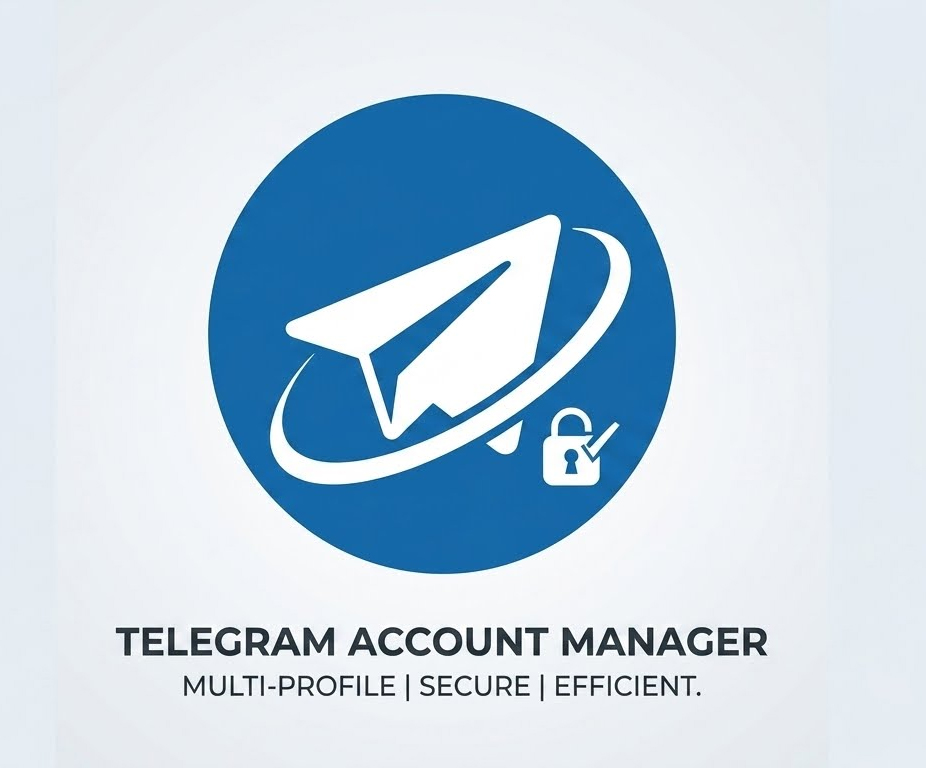
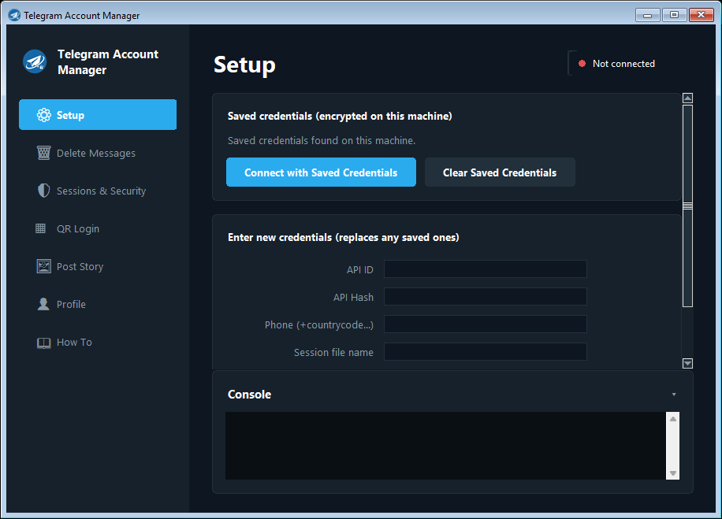
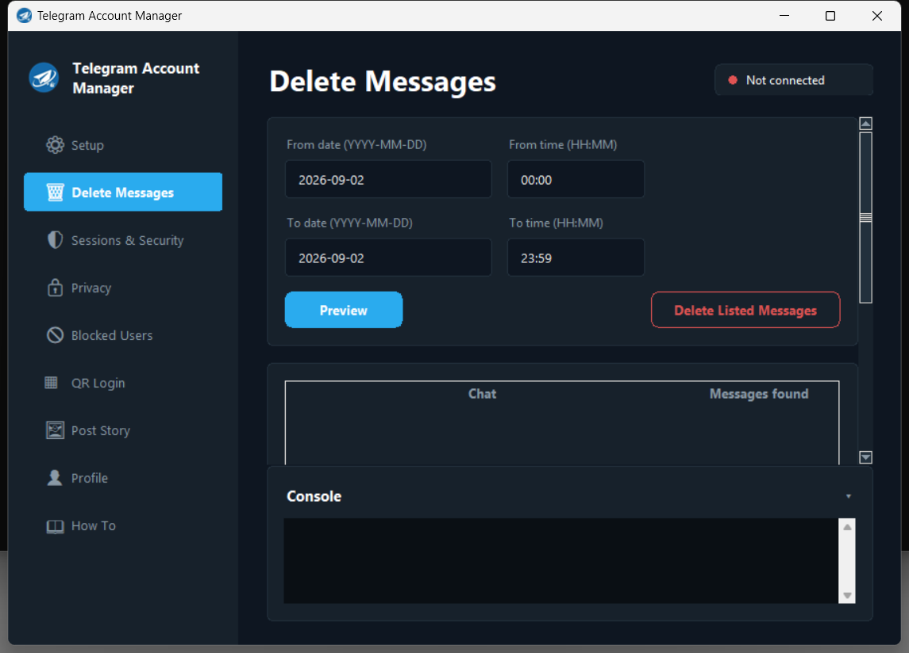
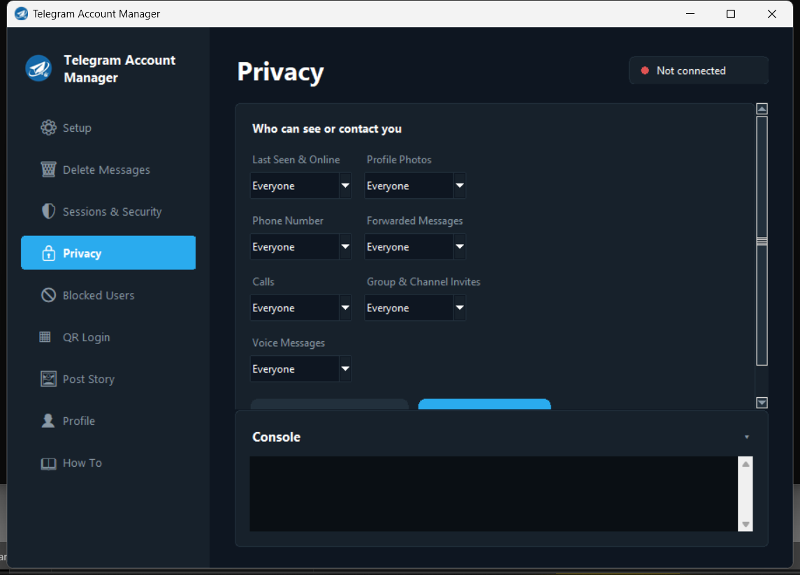

# TeleManager

<p align="center">
  
</p>

<p align="center">
  <a href="https://github.com/jocysite/TelegramManager/tags"></a>
  <a href="LICENSE"></a>
  
  
  <a href="https://github.com/jocysite/TelegramManager/stargazers"></a>
  <a href="https://github.com/jocysite/TelegramManager/issues"></a>
</p>

<p align="center"><strong>
A free, open-source, fully auditable desktop app for managing your own Telegram
account — no ads, no telemetry, no third-party servers.
</strong></p>

TeleManager gives you a single, secure control panel for the account-management
tasks Telegram itself scatters across menus: cleaning up old messages in bulk,
auditing and killing sessions you don't recognize, locking down your privacy
settings, and more. It talks directly to Telegram's own API — the same one the
official apps use — so nothing you do ever passes through a server we operate,
because we don't operate one. The interface is styled after Telegram Desktop's
own settings screens — rounded, focus-lit fields and the same dark theme — so
it feels like a natural extension of Telegram rather than a third-party tool
bolted on top.

## Table of contents

- [Why you can trust it](#why-you-can-trust-it)
- [Features](#features)
- [Screenshots](#screenshots)
- [Installation](#installation)
- [Getting your Telegram API credentials](#getting-your-telegram-api-credentials)
- [Usage](#usage)
- [Building the Windows executable](#building-the-windows-executable)
- [Security & privacy](#security--privacy)
- [FAQ](#faq)
- [Requirements](#requirements)
- [Contributing](#contributing)
- [Disclaimer](#disclaimer)
- [About](#about)
- [License](#license)

## Why you can trust it

Handing an app access to your Telegram account is not a small ask, so
TeleManager is built to make that decision easy to verify rather than
something you have to take on faith:

- **100% open source.** Every line that runs on your machine is in this
  repository. There is no hidden binary, no minified blob, no compiled
  component you can't read. If you can read Python, you can audit exactly
  what TeleManager does before you ever run it.
- **No backend, no telemetry, no analytics.** TeleManager has no server of
  its own. It makes calls straight to Telegram's official API via
  [Telethon](https://github.com/LonamiWebs/Telethon), a mature, widely-used
  open-source library, the same way the official Telegram Desktop and mobile
  apps do. Nothing about your usage, your account, or your messages is sent
  anywhere else — there's nowhere else in the code for it to go.
- **Your credentials never leave your machine.** Your API ID, API hash, and
  phone number are encrypted at rest with your operating system's own secure
  credential store (Windows Credential Manager, protected by DPAPI) and are
  tied to your specific Windows user account and device. They are never
  written to a plain-text file and never transmitted anywhere by this app.
- **Scoped to your own account, always.** Every action in TeleManager
  operates on the account you're logged into. It has no code path that reads,
  modifies, or deletes anything belonging to anyone else.
- **Destructive actions are gated, not automatic.** Bulk deletion always
  starts with a non-destructive **Preview** step. Session termination,
  unblocking, and account deletion all require an explicit confirmation, and
  account deletion additionally requires re-entering your password and typing
  a confirmation phrase.
- **No obfuscation in the build pipeline either.** The PyInstaller build
  scripts that produce the Windows executable are committed to this
  repository too, so you can see exactly how the `.exe` is assembled from the
  source you just read, or skip the executable entirely and run the app
  straight from source with Python.

If you'd rather not take any of the above on faith, that's the point — clone
the repo and read `telegram_manager_app.py` yourself before you enter a
single credential.

## Features

**Account security**
- View every device and app currently logged into your account and terminate
  any you don't recognize, individually or all at once
- Set, change, or remove your Two-Step Verification (2FA) password, with an
  optional hint and recovery email
- Review and revoke every website or bot you've authorized via "Log in with
  Telegram"
- Permanently delete your account, with explicit multi-step confirmation

**Privacy controls**
- Choose who can see your last-seen/online status, profile photos, phone
  number, forwarded messages, calls, group/channel invites, and voice
  messages — Everyone, My Contacts, or Nobody
- View, block, and unblock users

**Message management**
- Bulk-delete your own messages across every chat and group within a precise
  date *and time* range, with a mandatory preview before anything is deleted

**Account & presence**
- Log another device into your account via QR code, using your PC's webcam —
  no SMS required
- Publish a photo or video to your Telegram Story with a caption and privacy
  setting
- Edit your name, username, and bio, and upload or remove your profile photo

**Built-in guidance**
- A full in-app "How To" page walks through every feature and where to get
  your API credentials, so you're never left guessing

## Screenshots

<p align="center">
  
  
  
</p>

## Installation

### Option A: Run from source (recommended if you want to audit the code first)

```bash
git clone https://github.com/jocysite/TelegramManager.git
cd TelegramManager
pip install -r requirements.txt
python telegram_manager_app.py
```

The QR Login feature needs a webcam and OpenCV, already included in
`requirements.txt` (`opencv-python`). Skip installing it if you don't plan to
use that feature.

### Option B: Build the Windows installer yourself

See [Building the Windows executable](#building-the-windows-executable) below.
Building it yourself — rather than downloading a binary from a stranger on
the internet — is the most trustworthy way to get a `.exe`: you know exactly
what went into it because you just read the source and ran the build script
in front of you.

> **A note on SmartScreen / antivirus warnings.** Windows may flag a
> self-built, unsigned executable as "unrecognized" the first time you run
> it — this is standard for small open-source projects that don't pay for a
> commercial code-signing certificate, and it is *not* a sign of tampering.
> If you'd rather avoid the warning entirely, run the app from source with
> Python instead (Option A).

## Getting your Telegram API credentials

1. Go to [my.telegram.org](https://my.telegram.org) and log in with your
   phone number.
2. Click **API development tools**.
3. Fill in any App title / short name and submit.
4. Copy the **App api_id** and **App api_hash** shown — you'll paste these
   into the app's Setup page.

These credentials identify *your app instance* to Telegram; they are not a
password and are separate from your Two-Step Verification password.

## Usage

Enter your API ID, API Hash, and phone number in the Setup page and click
**Save & Connect**. The first time, Telegram sends you a login code (via the
Telegram app on another device, or SMS) — enter it in the popup. If Two-Step
Verification is enabled, you'll be asked for that password too. Credentials
are then encrypted and saved locally, so next time you can just click
**Connect with Saved Credentials**.

Full step-by-step instructions for every page are also built into the app's
**How To** section.

## Building the Windows executable

Two PowerShell scripts, both committed to this repo, handle the build:

```powershell
.\build_windows_exe.ps1
```

Produces a standalone `dist\TeleManager.exe`, built from source with
PyInstaller, using the icon and assets in this repository. First launch may
take a moment longer while it unpacks into a temporary folder.

```powershell
.\build_installer.ps1
```

Produces `dist\TeleManager-Setup.exe` — a proper installer that copies the
app to your machine and creates Desktop / Start Menu shortcuts with the
TeleManager icon.

## Security & privacy

- Your API ID/Hash/phone are encrypted via your OS's credential store
  (Windows Credential Manager, protected by DPAPI) — tied to your specific
  Windows user account and machine. They are never written to a plain-text
  file and never appear anywhere in this repository's code.
- The `.session` file created after you log in represents an active login to
  your account — anyone who obtains that file has the same access as being
  logged in. It's excluded from version control via `.gitignore`; **never
  share it with anyone, including in a bug report.**
- Deleting messages, terminating sessions, and deleting your account are
  irreversible. The app always requires an explicit confirmation step before
  any of them, and message deletion additionally requires a **Preview** pass
  first.
- This project is not affiliated with, endorsed by, or sponsored by
  Telegram. It's an independent client built entirely on Telegram's public,
  documented API.

## FAQ

**Is it safe to enter my API credentials and log in?**
The app only ever talks to Telegram's servers, directly, using the official
API. There is no TeleManager server in the middle. You can verify this
yourself by searching the source for any outbound network call that isn't to
Telegram — there isn't one.

**Does TeleManager store or upload my messages anywhere?**
No. Message previews and lists are held in memory for the current session
only, purely so the app can show you what it's about to act on. Nothing is
written to disk beyond Telegram's own local session file, and nothing is
sent to any server other than Telegram's.

**Why does my antivirus flag the downloaded `.exe`?**
Unsigned executables from small open-source projects are commonly flagged by
default, regardless of what they actually do — code-signing certificates
cost money most independent projects don't have. Build it yourself from the
source in this repo, or run the app directly with Python, to sidestep the
warning entirely while getting the exact same code.

**Can this app affect anyone else's account?**
No. Every request TeleManager makes operates on the account you're currently
logged into. There is no functionality anywhere in the app that targets
another user's account, messages, or data.

## Requirements

- Windows (uses Windows Credential Manager for encrypted credential storage
  via `keyring`'s Windows backend)
- Python 3.9+ (only if running from source)
- A webcam, only if you want to use QR Login

## Contributing

Issues and pull requests are welcome. If you're proposing a larger change,
please open an issue first to discuss the approach. Security-relevant
findings are especially appreciated — see [Security & privacy](#security--privacy)
for the trust model this project is built on.

## Disclaimer

TeleManager is an independent, community-built tool and is not affiliated
with, endorsed by, or sponsored by Telegram FZ-LLC. "Telegram" is a
trademark of its respective owner. Use of the Telegram API through this app
is subject to [Telegram's Terms of Service](https://telegram.org/tos).

## About

**TeleManager** is developed and maintained by **Yosef Mulatu**.

- Email: [josephmulatu1@gmail.com](mailto:josephmulatu1@gmail.com)
- Telegram: [@jocyj](https://t.me/jocyj)

The same contact details, with one-click copy, are available inside the app
itself on the **About** page.

## License

Released under the [MIT License](LICENSE) — free to use, modify, and
distribute.
